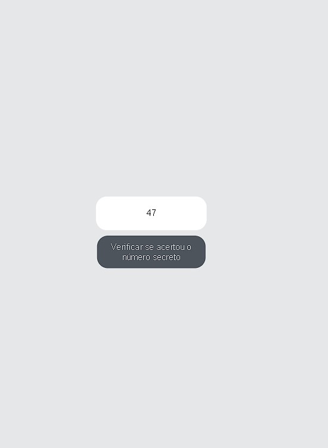
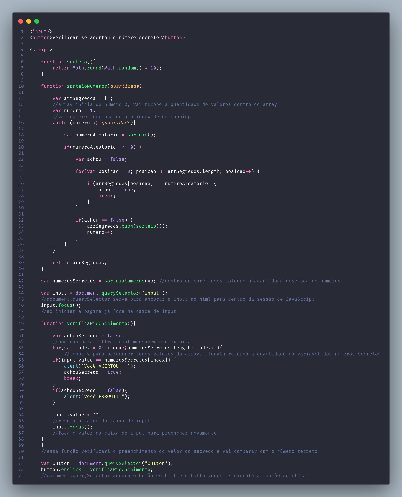

# Exercitando lógica de programação

Criando jogo de adivinhação numérica de 1 a 10 com interface.
  
  * Comunicação com o usuário;
  * Programa dinâmico com variáveis
  * Praticando resolvendo problemas do dia a dia
  * Laços de repetição
  

## Tecnologias utilizadas: 

    
      
   
  

  
## Preview

    

